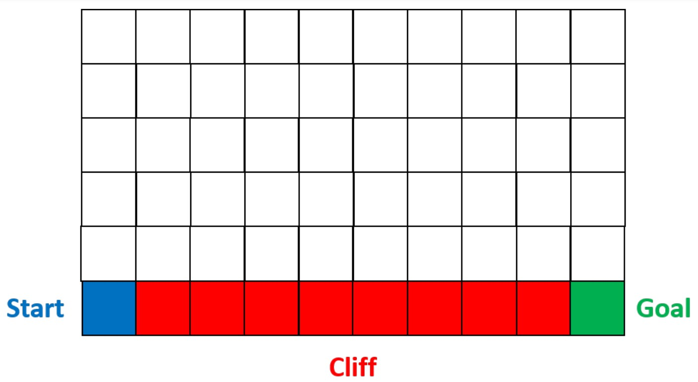

# Actor-Critic: Deep Reinforcement Learning

Solving the Cliff Walking problem using Actor-Critic for policy learning, a Deep Reinforcement Learning technique implemented using PyTorch.

The agent's aim is to reach the Goal from the Start point. The red cells are the Cliff which is game over.

