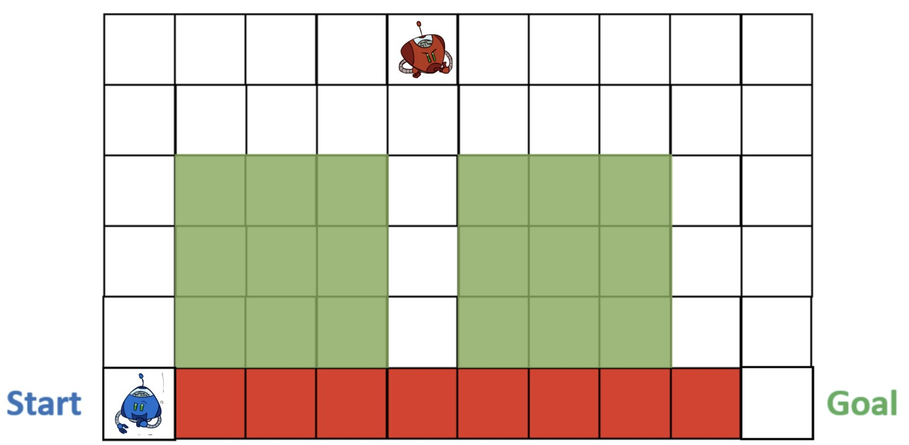

# Minimax with Alpha-Beta Pruning

We solve the "cliff walking" zero-sum game using Minimax Search with alpha-beta pruning and depth limited to d=(2,6) layers.

### Minimizing Player Rules

The minimizing player controls the red agent and does not take into consideration costs for its actions/movements. The only objective of the red agent is to block the path of the blue agent from getting to the Finish. It does not enter the cliff and always stays alive.

### Maximizing Player Rules

The maximizing player controls the blue agent and has costs associated with its actions/movements. The color of the cells represent the nature & cost of the regions:
* green/blue cells represent water region (cost=5) 
* white cells represent safe, non-water region (cost=1) 
* red cells represent cliff (game over)

