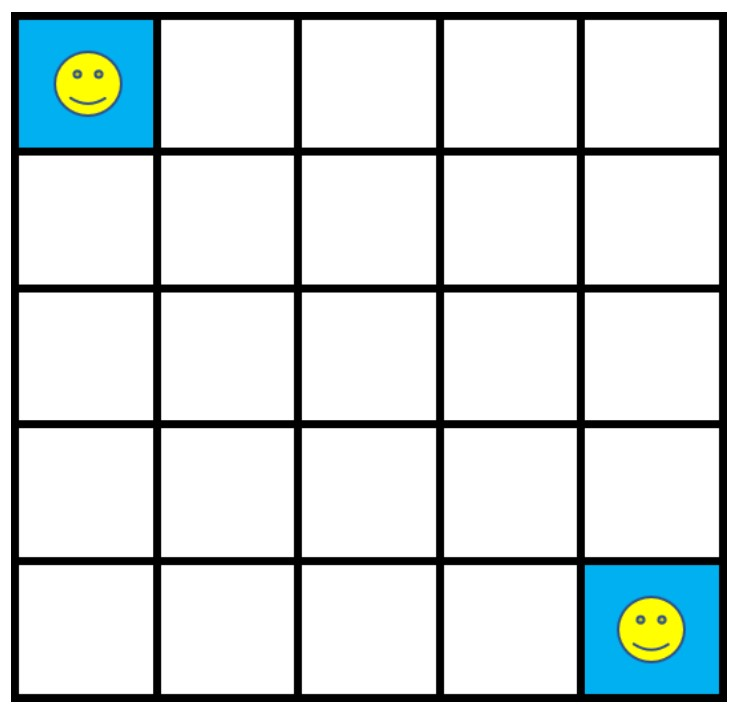

# Q-learning: Markov Decision Process in Reinforcement Learning

We can update the Q-value function of the game grid shown using the following algorithms:
1. Value Iteration (Bellman's Equation)
2. Epsilon-greedy Q-learning
3. Deep Q-learning with Experience Replay

